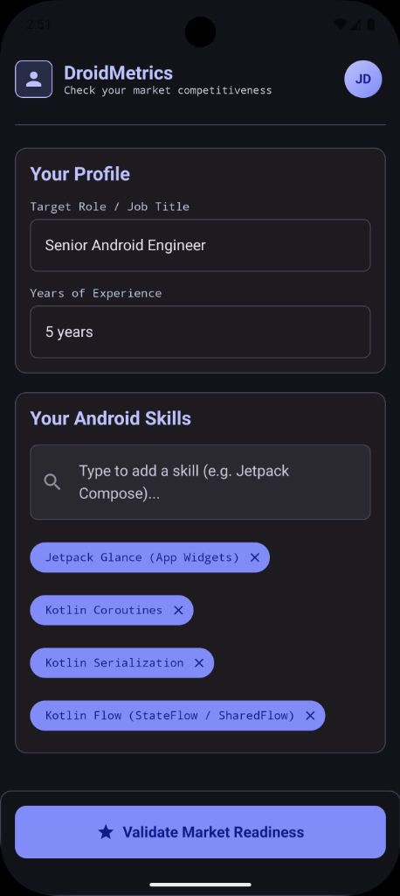
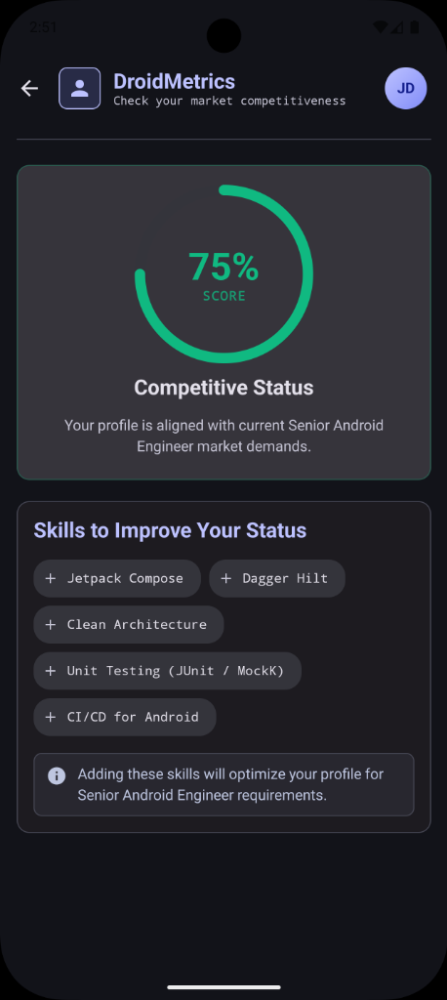

# DroidMetrics

DroidMetrics is an Android application designed to evaluate a developer's profile alignment with current market demands and provide suggested skill improvements. It utilizes structured generative AI predictions directly from Gemini models using the Firebase AI Logic SDK.

## Screenshots

| Profile Setup Screen | Competitive Status Screen |
| :---: | :---: |
|  |  |

## Technologies Used

*   **Core UI**: Jetpack Compose & Material Design 3 (M3)
*   **Architecture**: MVVM (Model-View-ViewModel) + Clean Architecture structure
*   **Dependency Injection**: Dagger Hilt (`hilt-android`, `hilt-compiler`)
*   **Navigation**: Jetpack Compose Navigation & Hilt Navigation Compose
*   **Asynchronous Flow**: Kotlin Coroutines & Kotlin Flow (`StateFlow` / `SharedFlow`)
*   **Logging**: Timber
*   **GenAI Integration**: Firebase AI Logic SDK (`firebase-bom`, `firebase-ai`) with `"gemini-3.5-flash"` and structured JSON response schemas
*   **Build System**: Gradle with Kotlin DSL (`build.gradle.kts`) and Version Catalogs (`libs.versions.toml`)

---

## Setup & Compilation Steps

To clone, compile, and run the project locally, follow these steps:

### 1. Add Firebase Configuration
Since credentials are excluded from source control for security reasons, you must provide your own Firebase configuration:
*   Go to your [Firebase Console](https://console.firebase.google.com/).
*   Add an Android app with package name **`android.ai.droidmetrics`**.
*   Download the **`google-services.json`** configuration file.
*   Place the file into the project's **`app/`** directory:
    `app/google-services.json`

### 2. Configure Local SDK (Optional)
If your Android SDK is not in the default location, define it in a `local.properties` file at the root of the project:
```properties
sdk.dir=C\:\\Users\\<YourUsername>\\AppData\\Local\\Android\\Sdk
```
*(Opening the project in Android Studio will automatically generate this file for you).*

### 3. Compile the Project
Open a terminal in the root directory of the project and run:

**Windows (PowerShell / Command Prompt)**:
```powershell
.\gradlew.bat compileDebugKotlin
```

**macOS / Linux**:
```bash
./gradlew compileDebugKotlin
```

### 4. Build the App Package (APK)
To compile and assemble the debug APK:

**Windows**:
```powershell
.\gradlew.bat assembleDebug
```

**macOS / Linux**:
```bash
./gradlew assembleDebug
```
